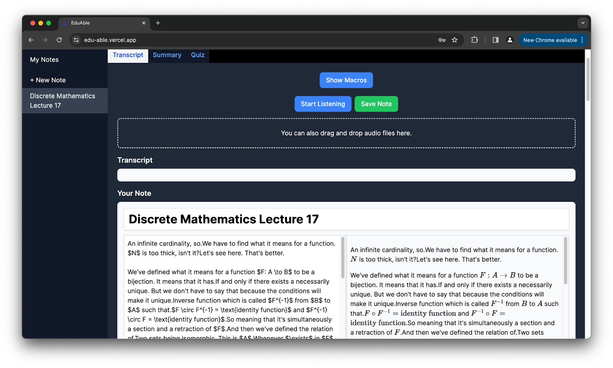
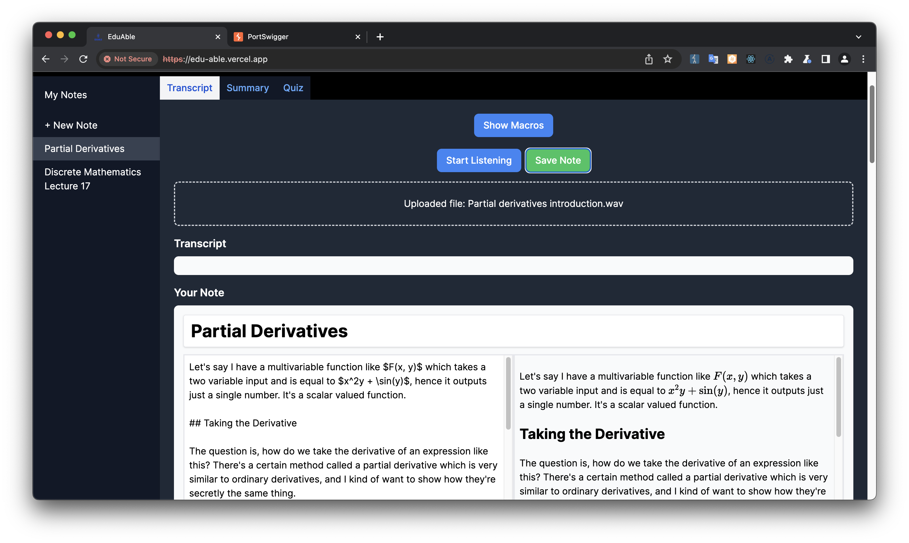
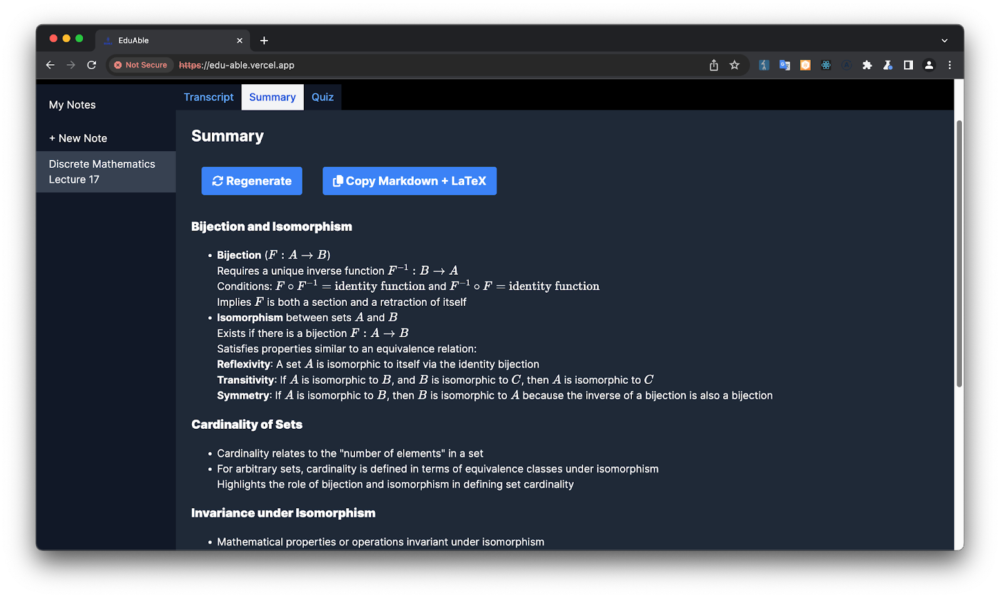
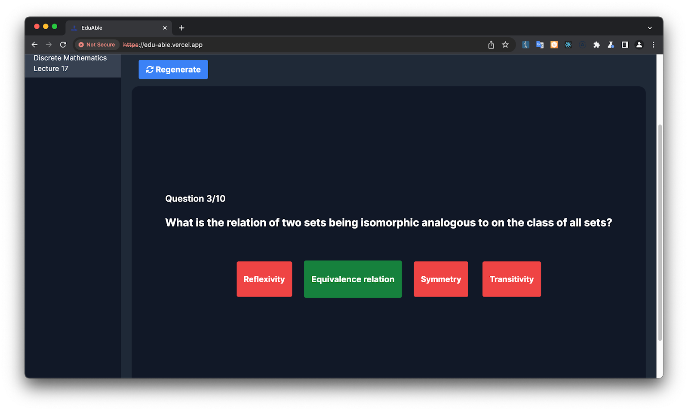
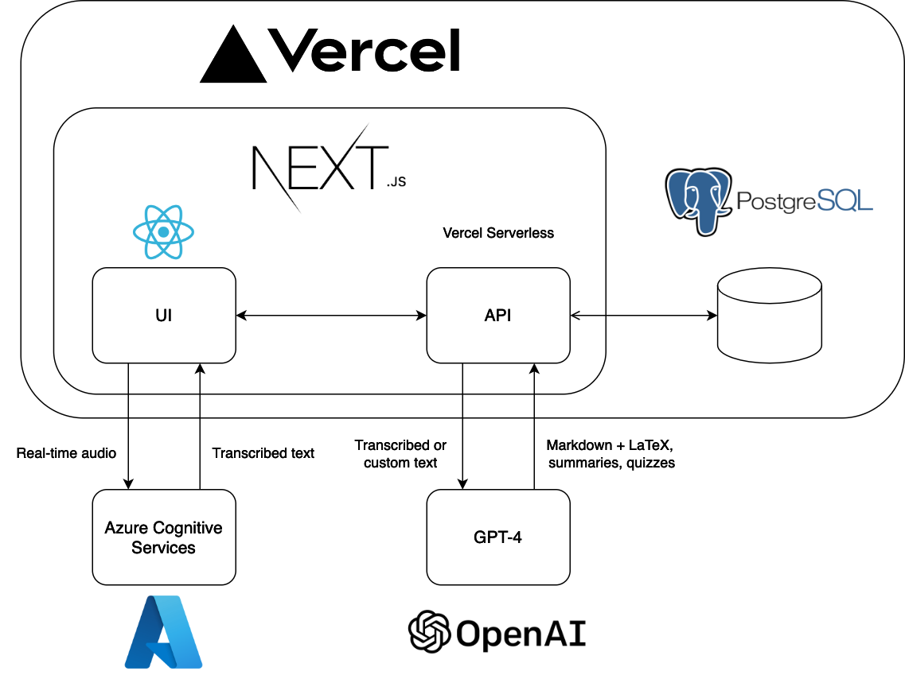

# EduAble

Making STEM notetaking accessible for all. Created in 36 hours for the Cambridge Generative AI Hackathon 2024.

[YouTube Demo](https://www.youtube.com/watch?v=PWzY63zfQhQ)

## Inspiration

Have you ever sat in a STEM lecture and felt overwhelmed by the amount of information being thrown at you? Did you struggle to type/write useful notes while also keeping up with the pace of the lecture?

If only there was a way to automatically transcribe the lecture, *while still keeping the mathematical notations and expressions intact*... that way, you don't have to worry about figuring out the right LaTeX expressions and can focus on engaging with the material, rather than on typing or writing.

This is a problem that I, and many others face everyday. Beyond that, students with disabilities may not be able to type or write as quickly as others, and are disproportionately affected by this issue.

## What it does

- Live transcription (or from an audio file) and conversion to Markdown and LaTeX. Can be used to transcribe lectures in real-time, or simply to take notes without using your hands.

- Summaries generated from the transcribed notes.
- Quizzes generated from the transcribed notes.

## Stack

## Setup

This project is deployed on Vercel. The following environment variables are required: 

- `JWT_SECRET`: Secret key used to sign JWT tokens for user authentication.
- `OPENAI_API_KEY`: API key to use OpenAI GPT-4.
- `SPEECH_KEY`: API key to use Azure AI Speech Services.
- `SPEECH_REGION`: Region of the Azure AI Speech Services instance.
- `POSTGRES_*`: PostgreSQL database connection details. This will be automatically configured when setting up Vercel Postgres.
